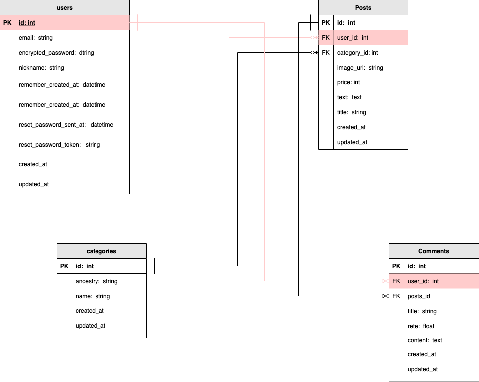
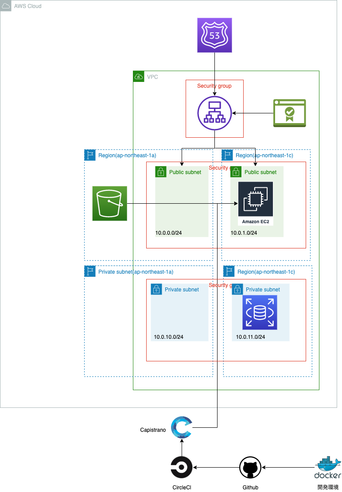

## 【PCパーツ投稿サイト】


## 概要
PCパーツを投稿するアプリケーションです。ユーザーが使用しているパーツやユーザーが購入したパーツを登録できます。
登録した情報はリストとして表示され、編集、削除、ページネーションが可能です。
スマートフォン様にレスポンシブ対応もしております。
パーツを使用した感想を口コミで投稿できます。

## 【ポートフォリオURL】
なお、各機能や使用技術を紹介した記事をQiitaにも投稿しました。
https://qiita.com/hongjitufang25/items/0c78602333ba5503dc9d

Amazon Web Services https://pcparts.work/


## 【開発した背景】
私は趣味で自作PCを作成しており、他のユーザーがどんなパーツを使っているのか興味がありました。そこで、自作PCを作成しているユーザー同士が、パーツの投稿をし合うSNSを作ることで、パーツ選びに対する関心を深めたり、購入時の参考にできると思い制作しました。

## 使用イメージ
## ログイン/ログアウト


## 投稿機能


## 詳細画面


## マイページ


## アイテム更新・削除


## 検索


## カテゴリー検索


## 口コミ投稿


## 口コミ更新・削除


## 使用技術

* OS
  * mac Catalina バージョン 10.15.7
* フロントエンド
  * jQuery 4.4.0
  * Vue.js 2.6.12
  * HTML/SCSS/bootstrap4

* バックエンド
  * Ruby 2.6.6
  * Ruby on Rails 5.2.4.3

* インフラ
  * CircleCI
  * Docker 3.3.3/docker-compose 1.29.1
  * PostgreSQL 13.2/pgadmin4
  * Amazon Web Services(EC2, S3, VPC, Route 53, ACM, ALB, IAM, RDS)

* バージョン管理
  * github

* その他の使用ツール
  * Visual Studio Code
  * draw.io

## 【ER図】



## 各テーブルについて

| テーブル名|説明|
|:-:|:-:|
|users|登録ユーザー情報|
|posts|商品投稿の情報|
|categories|商品カテゴリーの情報|
|comments|商品の評価、コメント情報|


## [AWS構成図]


## 【機能一覧】
* ユーザー登録関連
  * 新規登録
  * ログイン、ログアウト機能
  * かんたんログイン機能（ゲストユーザーログイン）
* ページネーション機能
  * コメント一覧、投稿一覧
* コメント機能
  * コメント一覧機能（ページネーション）
* 検索機能
  * 投稿の検索
* フラッシュメッセージ表示機能
  * 投稿、編集、削除、ログイン、ログアウト、存在しない商品確認時にフラッシュメッセージを表示
* 画像アップロード(Amason S3バケット)
* マイページ関連
  * 投稿一覧
* RSpecテスト

## 環境構築手順
1. イメージを生成する

```
$ docker-compose build
```

2. Bundle Install

```
$ docker-compose exec web bundle install
```

3. コンテナを起動する
   データベースセットアップ前にコンテナを起動していないとデータベースのセットアップコマンドが失敗する

```
$ docker-compose up
```

4. データベースをセットアップする

```
$ docker-compose exec web bundle exec rails db:create db:migrate db:seed_fu
```

6. RuboCop を実行する

```
$ bundle exec  rubocop
```

## npm ライブラリインストール

```
docker-compose exec web yarn
```

docker-compose を利用しないとホスト用のライブラリがインストールされてしまい、Docker イメージ上の Linux OS 上で実行できなくなる場合がある。